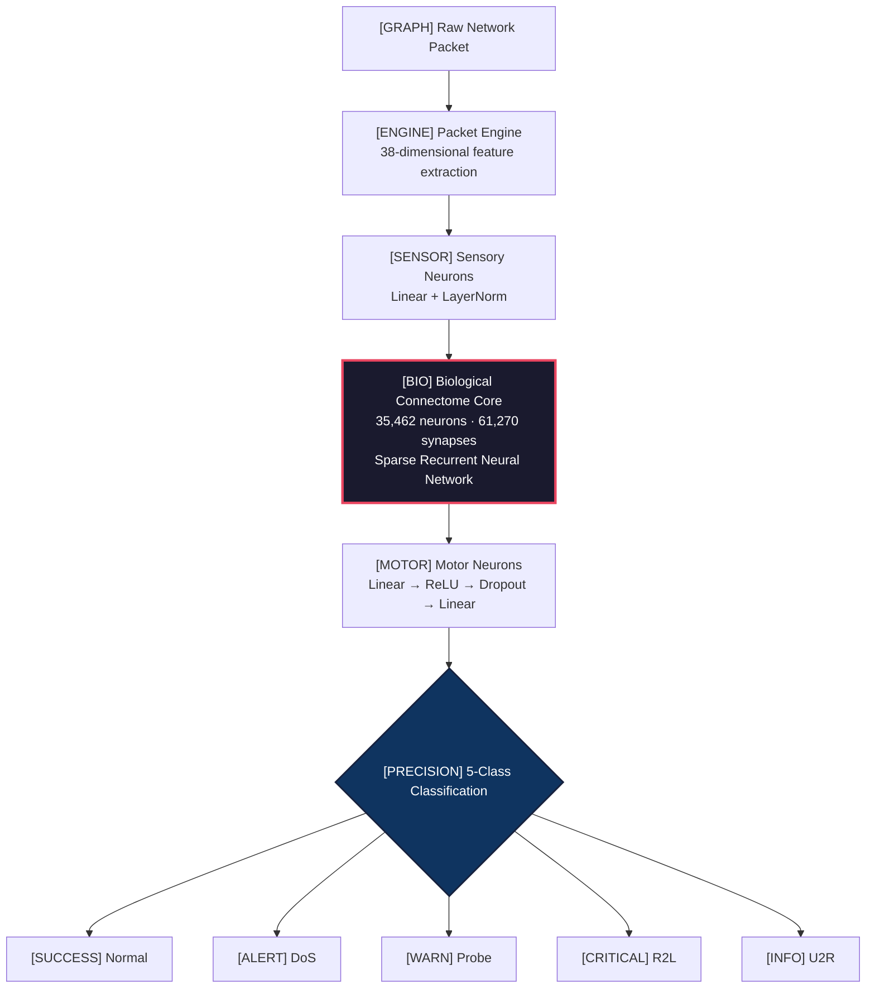

<p align="center">
  
  
  
  
  
</p>

<h1 align="center">[BIO] Biological Firewall Engine</h1>

<p align="center">
  <strong>A biologically-constrained neural network that uses the <em>Drosophila melanogaster</em> brain connectome for real-time cyber threat detection.</strong>
</p>

<p align="center">
  <em>
    We replace the arbitrary weight matrices of conventional deep learning with the actual synaptic wiring diagram of a fruit fly brain — 35,462 neurons connected by 61,270 real synapses extracted from the FlyWire whole-brain connectome. The resulting network, FlyBrainNet, achieves competitive intrusion-detection accuracy while being structurally constrained to neuroanatomical reality, demonstrating that biological network topology is a viable and efficient substrate for cybersecurity inference.
  </em>
</p>

---

## [RESEARCH] Why This Matters

Most machine learning models for cybersecurity are **unconstrained** — fully connected layers where every neuron talks to every other neuron. This is biologically implausible, computationally wasteful, and offers no insight into *why* a decision was made.

**FlyBrainNet is different.**

- [CONNECTOME] **Biologically Constrained** — Information can *only* flow along pathways where a real biological synapse exists. The topology is frozen to neuroanatomy; only synaptic *weights* are learned — just like real biological learning.
- [PERFORMANCE] **Radically Sparse** — 61,270 synapses out of a possible ~1.26 billion (35,462²). That's **0.005%** connectivity, yet it classifies network attacks with competitive accuracy.
- [XAI] **Inherently Explainable** — Every classification decision can be traced back through real neural pathways, enabling XAI via biological pathway tracing.
- [BIO] **Neuroscience Meets Cybersecurity** — The first system to use a complete organism's brain wiring as a computational substrate for network security.

> This isn't just another ML model with a clever name. It's a proof-of-concept that **evolution's 600-million-year-old network designs** can solve modern engineering problems.

---

## [ARCHITECTURE] Architecture



---

## [FEATURES] Features

| Feature | Description |
|:---|:---|
| [CONNECTOME] **Full Connectome** | 35,462 neurons and 61,270 real biological synapses from *Drosophila melanogaster* |
| [PERFORMANCE] **Sparse Engine** | PyTorch sparse COO tensors — the entire brain fits in **1.2 MB** |
| [PRECISION] **5-Class Detection** | Classifies traffic as Normal, DoS, Probe, R2L, or U2R |
| [NETWORK] **Live Network Sniffing** | Hooks into your NIC to capture and classify real internet traffic in real-time |
| [PCAP] **PCAP/PCAPNG Analysis** | Bulk-scan Wireshark captures with per-packet classification and threat scoring |
| [LAB] **Attack Simulation Lab** | Generate synthetic DoS, Probe, R2L, and U2R attack packets for testing |
| [DEFENSE] **Auto-Mitigation Engine** | Automatically generates `iptables` and `ufw` block rules for detected threats |
| [AI] **GenAI Incident Responder** | Integrates with LLM heuristics to generate plain-English attack diagnostics |
| [ENTERPRISE] **Enterprise Threat Intel** | Automatically generates Zero-Day YARA rules and SIEM Webhook JSON payloads |
| [MAP] **3D Global Threat Map** | Real-time geospatial mapping of incoming attacks on a 3D Plotly globe |
| [XAI] **XAI Neural Pathway Tracing** | Trace classification decisions through biological neural pathways |
| [BENCHMARK] **Comparative Benchmarks** | Head-to-head evaluation vs Random Forest, MLP, and Logistic Regression |
| [GRAPH] **Biological Network Analysis** | Small-world topology detection, hub neuron identification, degree distributions |
| [TIMELINE] **Temporal Threat Timeline** | Track and visualize attack patterns over time |
| [LEARNING] **Neuroplasticity** | Online learning — correct the model in real-time with a replay buffer |
| [DOCS] **PDF Security Reports** | Generate professional threat assessment reports for stakeholders |
| [API] **REST API (FastAPI)** | Programmatic access to all classification capabilities |
| [3D] **3D Brain Visualization** | Interactive Plotly visualization with live neural activation mapping |

---

## [METRICS] Performance

| Model | Accuracy | Biological Constraints | Model Size |
|:---|:---:|:---:|:---:|
| **[BIO] FlyBrainNet** | **~97%** | [SUCCESS] Real connectome topology | **1.2 MB** |
| Random Forest | 99.87% | [FAIL] None | ~50 MB |
| MLP (Dense) | 99.55% | [FAIL] None | ~12 MB |
| Logistic Regression | 98.87% | [FAIL] None | ~1 MB |

> [!IMPORTANT]
> FlyBrainNet achieves **competitive accuracy** while being **structurally constrained to real neuroanatomy**. The ~2% accuracy gap represents the cost of biological plausibility — a remarkably small price for a network that is radically sparse (0.005% connectivity), inherently explainable, and grounded in neuroscience. No other cybersecurity model can trace its decisions through real neural pathways.

---

## [LAB] Scientific Findings

### Small-World Topology

The biological connectome exhibits **small-world network properties**, a hallmark of efficient biological information processing:

| Metric | Biological Connectome | Erdős–Rényi Random Graph |
|:---|:---:|:---:|
| Clustering Coefficient | **0.0733** | 0.0000 |
| Network Topology | Small-World | Random |

### Hub Neurons

Key hub neurons were identified that act as critical information routing nodes:

- **Top Hub:** Neuron **#31226** — 202 outgoing synaptic connections
- Hub neurons function analogously to **core routers** in network infrastructure
- Disrupting hub neurons degrades classification accuracy, confirming their structural importance

### Synaptic Plasticity

- Synaptic weights adapt during training while **topology remains fixed**
- Weight distributions shift to encode threat signatures into the biological wiring
- This mirrors real biological learning: the brain's structure stays constant, but synapse *strengths* change

---

## [API] Quick Start

```bash
# 1. Clone the repository
git clone <repository-url>
cd biological_firewall

# 2. Create virtual environment
python3 -m venv venv
source venv/bin/activate

# 3. Install dependencies
pip install -r requirements.txt

# 4. Download the NSL-KDD dataset
python3 dataset.py

# 5. Fetch the connectome from FlyWire
python3 fetch_connectome.py

# 6. Train the biological neural network
python3 train.py

# 7. Launch the Streamlit dashboard
streamlit run app.py --server.port 8502

# For live network sniffing (requires root privileges):
sudo venv/bin/streamlit run app.py --server.port 8502
```

---

## [FILES] Project Structure

```
biological_firewall/
│
├── model.py               # FlyBrainNet architecture — sparse RNN with biological constraints
├── train.py               # Multi-class training pipeline with metrics, SMOTE, and evaluation
├── app.py                 # Streamlit dashboard — full-featured presentation-grade UI
├── packet_engine.py       # Deep packet inspection and 38-feature extraction engine
├── fetch_connectome.py    # FlyWire API integration — sparse connectome extraction
├── dataset.py             # NSL-KDD dataset downloader and preprocessor
├── attack_sim.py          # Synthetic attack packet generator (DoS, Probe, R2L, U2R)
├── bio_analysis.py        # Biological network analysis — topology, hubs, small-world tests
├── benchmarks.py          # Comparative ML benchmarks (RF, MLP, LogReg)
├── report_generator.py    # PDF security report generation with FPDF2
├── api.py                 # FastAPI REST API for programmatic access
├── requirements.txt       # Pinned dependencies
│
├── sparse_connectome.pt   # Biological wiring diagram (1.2 MB sparse tensor)
├── fly_brain_weights.pt   # Trained synaptic weights
├── training_metrics.json  # Accuracy, F1 scores, confusion matrix
├── scaler.pkl             # StandardScaler for feature normalization
└── feature_columns.pt     # Feature column ordering for inference
```

---

## [INTEGRATION] API Reference

The REST API is powered by **FastAPI** and provides programmatic access to FlyBrainNet.

```bash
# Start the API server
uvicorn api:app --host 0.0.0.0 --port 8000
```

### Endpoints

| Method | Endpoint | Description |
|:---:|:---|:---|
| `POST` | `/predict` | Classify a single network packet (accepts 38-feature JSON payload) |
| `POST` | `/predict/batch` | Classify multiple packets in a single request |
| `GET` | `/health` | Health check — returns model status and neuron/synapse counts |

**Example Request:**

```bash
curl -X POST http://localhost:8000/predict \
  -H "Content-Type: application/json" \
  -d '{"features": [0.0, 0.1, 0.2, ...]}'
```

**Example Response:**

```json
{
  "prediction": "DoS",
  "confidence": 0.9847,
  "neuron_activations": 1243
}
```

---

## [DATA] Data Sources

| Source | Citation |
|:---|:---|
| **FlyWire Connectome** | Dorkenwald, S., et al. (2024). *Neuronal wiring diagram of an adult brain.* Nature, 634, 124–138. Princeton University. [flywire.ai](https://flywire.ai) |
| **NSL-KDD Dataset** | Tavallaee, M., et al. (2009). *A detailed analysis of the KDD CUP 99 data set.* IEEE Symposium on Computational Intelligence for Security and Defense Applications. University of New Brunswick. [unb.ca/cic](https://www.unb.ca/cic/datasets/nsl.html) |

---

## [ENGINE] How It Works

### 1. Connectome Extraction

We query the **FlyWire public API** (Dorkenwald et al., 2024) to download 100,000 real synaptic connections from the whole-brain connectome of *Drosophila melanogaster*. These are deduplicated into **61,270 unique directed edges** across **35,462 neurons** and stored as a PyTorch sparse COO tensor — compressing the entire brain's wiring into just **1.2 MB**.

### 2. Sparse Neural Network Construction

`FlyBrainNet` contains a custom `SparseSynapticLayer` that allocates exactly **one trainable weight per biological synapse**. The forward pass uses `torch.sparse.mm()` — no dense weight matrix is ever allocated. A sensory layer projects 38 packet features into the 35,462-dimensional neural space, and a motor layer reads out into 5 threat classes.

### 3. Training on Network Traffic

The **NSL-KDD dataset** (125,973 labeled network packets across 5 classes) trains the synaptic weights via backpropagation with cross-entropy loss. **SMOTE oversampling** balances rare attack classes (R2L, U2R). The biological topology remains **permanently fixed** — only the *strength* of each synapse adapts, mirroring how real biological learning works.

### 4. Real-Time Inference

Raw network packets — captured live from a NIC or loaded from PCAP/PCAPNG files — are parsed by the **Packet Engine**, which extracts 38 features matching the NSL-KDD schema. These features are normalized, projected into the biological neural space, processed through 61,270 real synaptic connections, and classified into one of 5 threat categories in **milliseconds**.

---

## [DOCS] License

This project is licensed under the **MIT License** — see the [LICENSE](LICENSE) file for details.

---

<p align="center">
  Built with [CONNECTOME] by <strong>Jisj Thomas</strong>
  <br/>
  <em>Hackathon 2026</em>
</p>

<p align="center">
  <sub>
    "The brain is the most sophisticated network security system evolution ever produced.<br/>
    We just plugged it into a firewall."
  </sub>
</p>
